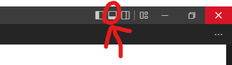

First, [create an account](https://github.com/join). Use your school email to get GitHub Student Developer Pack benefits. Then, install [Git](https://git-scm.com/download) and, for GitHub integration with Visual Studio Code, install [GitHub Pull Requests and Issues](https://marketplace.visualstudio.com/items?itemName=GitHub.vscode-pull-request-github). Then, configure everything (it should show notifications to help you with this.) Another helpful thing is
[GitHub Desktop](https://desktop.github.com/) to help manage the uploading process. Once downloaded, install it and follow the login process (I'm assuming you can do this yourself).
## Setting up Git

1. Open the terminal 
>

2. Ensure you're in the right directory. With `cmd`, it should appear next to your cursor. With `powershell`, you can use `pwd` to print the current directory. It should have some variation of `FRC2020` in it. If it doesn't, use `cd` to change to the right directory. You can use `ls` to list the contents of the current directory.

3. Run `git config --global user.name "Your Name"` to set your name. Replace "Your Name" with your name.

4. Run `git config --global user.email "your.email@uaschools.org"` to set your email. Replace "your.email" with your email.

After this, you have 2 options: **Upload your current workspace to the repository** or **Clone the repository to your current workspace**. The second option will start you fresh, but will get rid of your current code.

### Uploading your current workspace to the repository (recommended)

Now that you've set everything up, you'll want to upload your current workspace to the repository. This will allow you to work with your team members and keep track of your code and its latest changes.

1. Save everything in your workspace. You can do this by pressing `Ctrl + K then S` or by clicking `File (menu) > Save All` in the top left corner of the screen.
2. Fork the 2023 repository created by Parker B. at https://github.com/TheGamer1002/FRC2023/fork. Follow the instructions on the page to fork the repository.
3. You'll be taken to a new page. Click `Add file` and then `Upload files`. Hit `Select your files` and navigate to your workspace. Select all the files and hit `Open`. Then, hit `Commit changes`.
4. At this point, your code is now in GitHub. To test this, clone your new repository and open it in Visual Studio Code. If you can see your code, you're good to go. If not, you can try again or ask for help.
>To clone, go to your newly made repository and copy the URL. Then, in the terminal, run `git clone <URL>`. Replace `<URL>` with the URL you copied. Then, open the folder in Visual Studio Code. You can do this by running `code .` in the terminal.
> Make sure that the code is the same as in the local repository. If it isn't, you can try again or ask for help.

### Cloning the repository to your current workspace
This is still WIP. I'll finish it later.

### Creating a Pull Request
In your repository, there is a section above the file list that states that this is a fork. It should also have a button that says `Contribute`. Click it. Then, click `Create pull request`. You can add a title and description if you want. Then, click `Create pull request`. I will add you as a collaborator to the repository, and you can start working on the code. Make sure that once you're added, you clone the code fresh and start working on it there. In VSCode, it'll automatically help you with commiting and pushing.